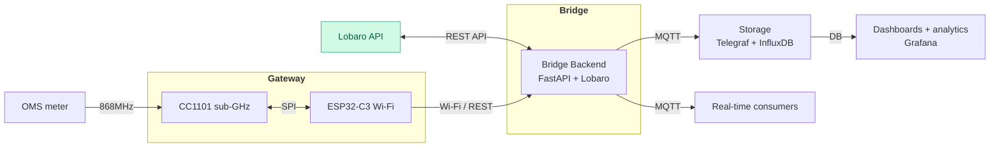
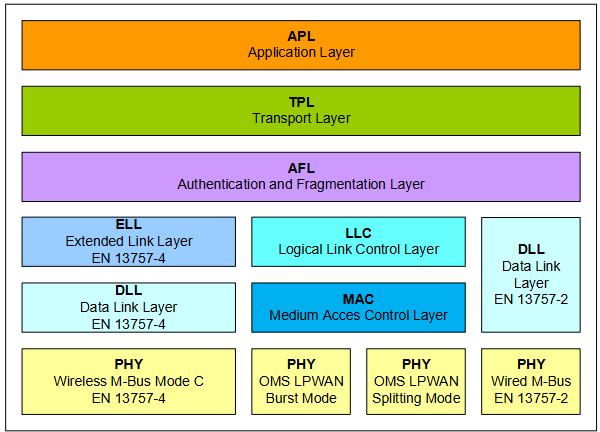
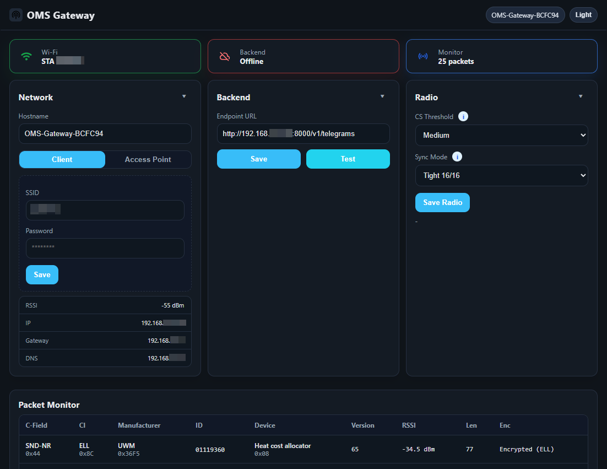
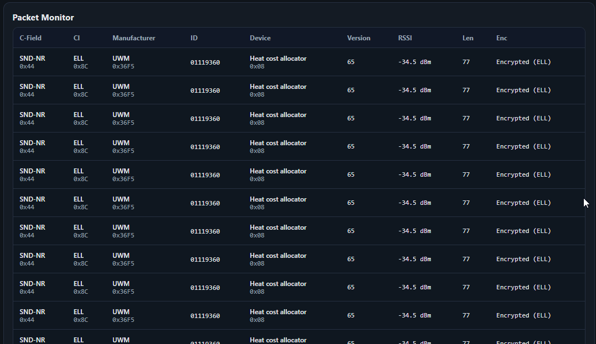
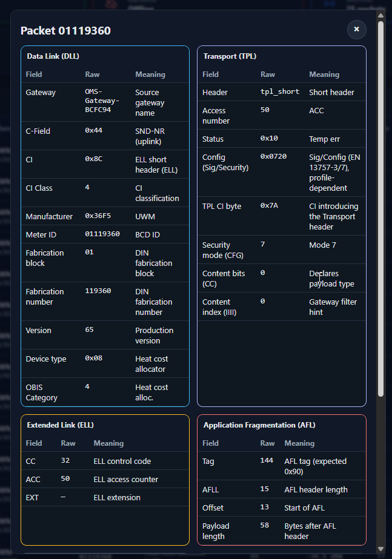
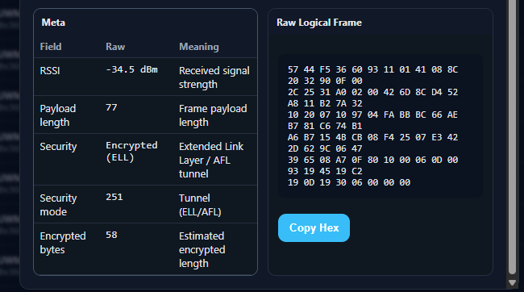
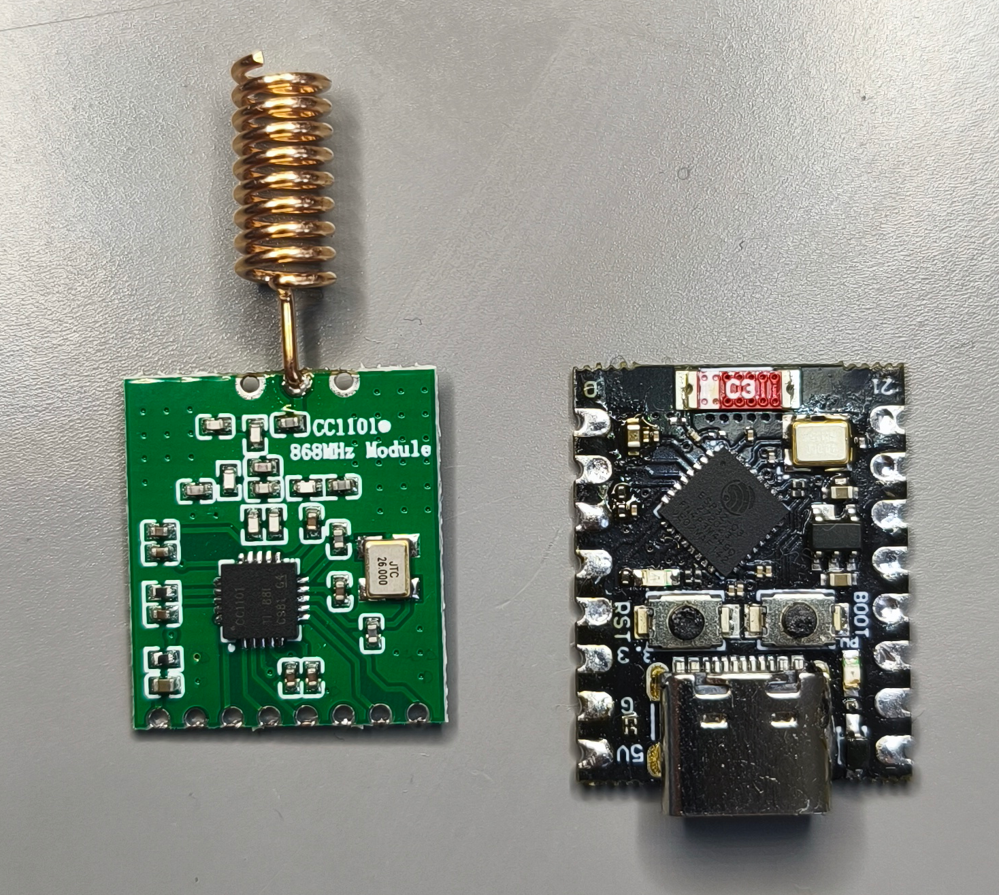
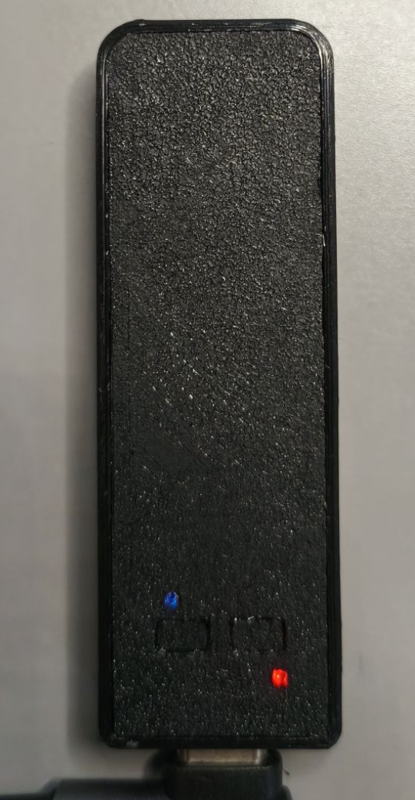

## OMS Gateway (ESP32-C3 + CC1101)

This project is the firmware for an OMS/W‑MBus gateway running on ESP32‑C3 + CC1101.
It receives OMS telegrams via the CC1101, decodes the link‑layer structure, exposes a Web UI,
and forwards logical frames with metadata over Wi‑Fi to a backend.
The system overview below illustrates the data flow from the meter through the gateway to the backend,
then via MQTT into storage and dashboards/analytics.

### System Overview


### Key Concepts
- RF bytes are 3-of-6 coded on air; the firmware decodes and validates CRC16 blocks.
- The logical frame is CRC-free and starts at L; logical length = L+1, payload_len = L-10.
- The gateway forwards logical frames and metadata; decryption and application parsing happen in the backend.
- Parsing of decoded meter data is handled by [Lobaro](https://confluence.lobaro.com/display/PUB/wMbus+Parser), as shown in the system overview.
- The Web UI exposes live radio stats, frame metadata, and raw logical hex for external tools.

For a layer-by-layer breakdown of the OMS stack and code references see `doc/OMS_PROTOCOL_STACK.md`.

### Protocol Layers
| Protocol layers                                                                                                                               |
| --------------------------------------------------------------------------------------------------------------------------------------------- |
|                                                                                                 |
| Diagram of the OMS stack we parse: PHY through DLL/ELL/TPL/AFL to APL, highlighting what the firmware extracts and what the backend finishes. |

### Encryption and Payload Strategy
- The gateway does not store keys and does not decrypt payloads.
- Transport/ELL/AFL parsing identifies where encrypted bytes sit in the logical frame.
- Full decoding is delegated to the backend.

### Web UI
Single-page UI for configuration and live monitoring.

| Web UI                                                                                                 |
| ------------------------------------------------------------------------------------------------------ |
|                                                                         |
| Main Web UI showing status cards, network/backend/radio controls, and quick device health at a glance. |

| Packet Monitor                                                                                           |
| -------------------------------------------------------------------------------------------------------- |
|                                                    |
| Packet Monitor table with live frames, metadata, and quick indicators for encryption and signal quality. |

| Packet Details (Layers)                                                               |
| ------------------------------------------------------------------------------------- |
|                               |
| Packet details dialog showing per-layer cards and parsed fields for a selected frame. |

| Packet Details (Raw)                                                           |
| ------------------------------------------------------------------------------ |
|                        |
| Raw logical frame view with copy option for external tooling and verification. |

### Hardware
- ESP32-C3 (SuperMini form factor) + CC1101 868/886 MHz module.
- CC1101 breakout pinouts vary; use the TI datasheet as the wiring reference.

| Prototype hardware                                                                        |
| ----------------------------------------------------------------------------------------- |
|                                         |
| Prototype hardware: ESP32-C3 board paired with a CC1101 module for sub-GHz OMS reception. |

| Connected prototype                                                    |
| ---------------------------------------------------------------------- |
|  |
| Wiring between the ESP32-C3 and CC1101 during bring-up and RF testing. |

| Enclosure open                                          | Enclosure with lid                                     |
| ------------------------------------------------------- | ------------------------------------------------------ |
|  |  |

### Requests (HTTP)
Outbound to backend (configured URL):
- Method: POST
- Content-Type: application/json
- Body example:
```json
{
  "gateway": "oms-gateway",
  "status": 0,
  "rssi": -67.5,
  "lqi": 103,
  "manuf": 3246,
  "id": "12345678",
  "dev_type": 7,
  "version": 1,
  "ci": 120,
  "payload_len": 77,
  "logical_hex": "2B44..."
}
```

Local device API (used by the Web UI):
- GET /api/status
- GET /api/packets
- POST /api/backend?url=...
- GET /api/backend/test?url=...
- POST /api/wifi?ssid=...&pass=...
- POST /api/ap?ssid=...&pass=...
- POST /api/radio?cs=...&sync=...
- See main/app/http_server.c for the full list.

### Quick build/flash
Run from repo root with ESP-IDF environment sourced:
```sh
idf.py set-target esp32c3    # one-time
idf.py build
idf.py -p /dev/ttyUSB0 flash
idf.py monitor
```
Adjust serial port as needed. Use `idf.py erase-flash` if NVS/config needs resetting.

### Repository Layout
- `main/app/`: runtime, services, Wi-Fi/backend forwarding, frame parsing, Web UI.
- `main/radio/`: CC1101 HAL, register presets, RX pipeline glue.
- `main/wmbus/`: OMS/W-MBus framing (3-of-6, CRC16), packet parsing, pipeline utilities.

### Packet Handling Flow (T-mode)
RX path (CC1101 to decoded packet):
- CC1101 strips preamble/sync and exposes 3-of-6 coded bytes in its RX FIFO.
- `wmbus_pipeline_receive` (`main/wmbus/pipeline.c`) reads the first coded bytes, decodes L-field, and sizes the packet.
- `wmbus_decode_rx_bytes_tmode` decodes the 3-of-6 stream and checks CRC16 blocks.
- If `rx_logical` is provided, CRC blocks are stripped and `frame_info` is filled for UI/backend use.

TX path (app to CC1101):
- Build a header (`wmbus_build_default_header`) or fill `WmbusFrameHeaderRaw`, then encode with `wmbus_encode_tx_packet_with_header`.
- `wmbus_encode_tx_bytes_tmode` converts raw packet bytes into 3-of-6 coded bytes.
