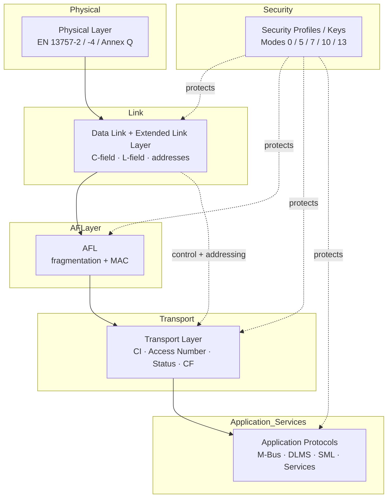
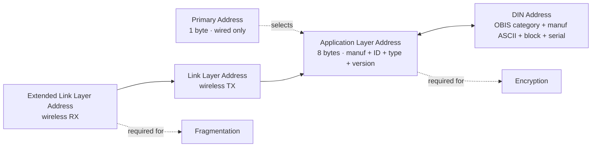
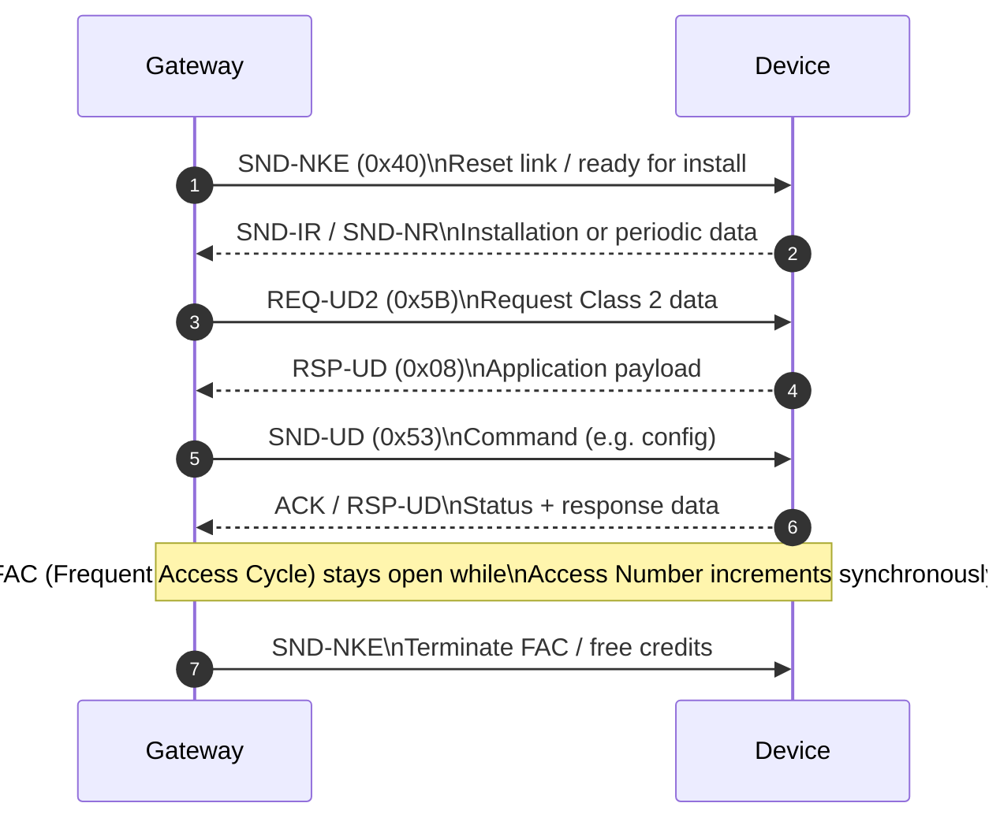

# OMS / Wireless M-Bus Protocol Stack Guide

This guide condenses the OMS Volume 2 Primary Communication specification (Issue 5.0.1, Dec 2023) and maps each layer to the firmware that lives in this repository. Use it as a beginner-friendly reference when decoding captured frames, creating new packet handlers, or explaining OMS/W‑M‑Bus behavior to other contributors.

## 1. Stack Overview (Vol.2 §§2–4)
- **Physical Layer** – Either wired M‑Bus per EN 13757‑2 or wireless mode C/OMS‑LPWAN per EN 13757‑4 / Annex Q. Defines media, frequencies, timing, and synchronous vs. asynchronous transmission rules.
- **Data Link + Link Control** – Frame Format A (DLL + optional Extended Link Layer) for mode C and Frame Format C (MAC/LLC) for OMS‑LPWAN. Carries the C‑field (message type), L‑field, transmitter/receiver addresses, and hopping/availability bits.
- **Authentication & Fragmentation Layer (AFL)** – Optional shim that adds fragmentation headers, message counters, MACs, and key hints whenever security profiles B–D or long messages are used.
- **Transport Layer (TPL)** – CI‑field plus a fixed header (none/short/long) containing Access Number, Status, and Configuration information that explains the application protocol to follow (M‑Bus, DLMS/COSEM, SML, management services).
- **Application Protocols** – M‑Bus data points (Annex B), DLMS (EN 13757‑1 / 62056‑6‑1), SML, and service-specific protocols (clock sync, application error, security management, image transfer, etc.) defined in Annex M.
- **Security & Key Management** – Security profiles A–D map onto security modes 0/5/7/10/13 and dictate encryption (AES‑CBC, AES‑CCM, TLS), MAC types, and key sources (persistent vs. derived).

> **Repository cross-reference** – `main/wmbus/` covers PHY/Link decoding, `app/wmbus/frame_parse.c` interprets Link/TPL/Application headers, `app/wmbus/packet_router.c` fans events out, `app/net/backend.c` forwards decoded payloads, and `app/radio/radio_config.c` configures CC1101 timing per the physical layer rules.

## 2. Physical Layer Essentials (Vol.2 §4)
- **Wired M‑Bus**: Two-wire, polarity independent bus per EN 13757‑2. Slaves include a 430 Ω series resistor to cap short-circuit current at 100 mA. Gateways power/read sensors in pull mode and must accept L‑fields ≤ 255 bytes. Mini-Master capability is the minimum baseline.
- **Wireless mode C (C1/C2)**: Operates in 868–870 MHz ISM bands with a recommended 0.02 % hourly duty cycle. End devices transmit periodically (push). Bidirectional communication happens within short receive slots directly after each transmission (Frequent Access Cycle). Synchronous transmissions use the S‑bit, Access Number, and deterministic timing; asynchronous transmissions cover alarms, ACK/NACK, and installation frames.
- **OMS‑LPWAN (Annex Q)**: Adds MAC scheduling, Forward Error Correction, and frame aggregation for long-range/battery-friendly deployments. Access options (MElements) advertise when a device can listen; special codes represent “no receive window” (pure push) or “always on” (mains powered).
- **Update cadence**: Table 8 enforces minimum data granularity for billing—e.g., electricity data every 15 min, gas/water every hour, heat/cooling every 24 h, heat cost allocators every 240 min. Mode C is expected to refresh at least each synchronous transmission, while LPWAN may batch multiple periodical values into a compact profile (formula `N_DP = TU / DG * 2`).

## 3. Addressing and Link Layer (Vol.2 §§3 & 5)
### 3.1 Address types
- **Primary Address (PA)** – 1‑byte wired M‑Bus slave address (1–250 valid, 0 unconfigured, 251–255 special). Selected via DL layer when no secondary addressing is required.
- **Secondary Address / ALA (Application Layer Address)** – 8‑byte structure (manufacturer ID, version, device type, serial). Immutable per device, globally unique, and transmitted in every message that uses a long TPL header. Primary address 253 announces that secondary selection is in use.
- **Link Layer Address (LLA)** – Wireless transmitter address embedded in Frame Format A. Uniquely assigned by manufacturers for all radio devices.
- **Extended Link Layer Address (ELLA)** – Destination address carried in the long ELL (CI = 0x8E). Required when (1) talking to unallocated devices or service tools, (2) responding to a request containing ELLA, (3) fragmenting messages (because only the first fragment has the ALA), or (4) addressing RF adapters.
- **DIN Address** – Printable format (OBIS category + ASCII manufacturer ID + fabrication block + serial) that maps 1:1 to secondary addresses.

### 3.2 Frame Format A (mode C)
- **Data Link Layer** – Fixed 10‑byte header (without CRC) carrying the L‑field (length) and C‑field. Bidirectional devices must support L ≤ 155; security profile C and OTA updates must honor L ≤ 255.
- **Extended Link Layer** – Short ELL (CI = 0x8C) adds only the Communication Control (CC) field; long ELL (CI = 0x8E) adds receiver Identification Number, Manufacturer ID, Version, and Device Type. CC bits: `B` (bidirectional available), `A` (access demand), `S` (synchronous transmission), `R/H` (repetition flags), `D` (downlink demand). When both CC and TPL Configuration fields exist, only CC bits are authoritative.
- **Hop control** – Repeaters set `H=1` and recalc CRC; senders keep `H`/`R` at 0. Hop bits also live in LPWAN LC[1] fields.

### 3.3 Frame Format C (OMS‑LPWAN)
- LLC combines transmitter (TXA) and receiver (RXA) addresses, removing the need for a separate ELL. LC[0] controls whether TXA/RXA are present, LC[1] embeds hop and accessibility flags, and MAC MElements advertise access options and session control.

### 3.4 Timing, credits, and access (Vol.2 §4.3)
- **Synchronous vs. asynchronous**: Synchronous messages set `S=1` and use deterministic Access Number increments (`ACC`), enabling gateways to predict RX slots (Figure 16). Asynchronous traffic (alarms, installations, commands) keeps `S=0` but still increments ACCESS according to EN 13757‑7.
- **Frequent Access Cycle (FAC)**: Mode C bidirectional devices must open the receive window defined in EN 13757‑4 §12.6.3.3 after each synchronous uplink. Gateways close the FAC with `SND‑NKE`. LPWAN uses a session control bit in the MAC downlink (Annex Q §3.3.5).
- **Credits (Tables 11–13)**: Each received or transmitted datagram consumes credits (e.g., receive SND‑UD → 2 credits, REQ‑UD1/2 → 1, send RSP‑UD → 1). Devices must offer at least 240 credits within the duty-cycle budget for mode C (120 for UL‑B4, down to 1–2 for S‑modes) and replenish counters every 2 h. Credits can accumulate up to 4000, but devices may pause communication after consuming 240 credits in 12 h even if credits remain.
- **Maximum access delay**: Table 12 caps the time between the first transmission without access and the first usable access opportunity (12–72 h depending on radio mode).

### 3.5 Link-layer message types (Vol.2 Tables 15 & 16)

| Direction | Message type | C‑field | Usage |
|-----------|--------------|---------|-------|
| Master → slave | `SND-NKE` | 0x40 | Link reset / announce capability to receive installation frames |
| Master → slave | `SND-UD2` | 0x43 | Command with mandatory response (not for fragmented messages) |
| Master → slave | `SND-UD` | 0x53 / 0x73 | Command / data download (FCB/FCV per EN 60870‑5‑2) |
| Master → slave | `REQ-UD1` | 0x5A / 0x7A | Alarm request (Class 1) |
| Master → slave | `REQ-UD2` | 0x5B / 0x7B | Data request (Class 2) |
| Master → slave | `CNF-IR` | 0x06 | Confirms successful installation |
| Slave → master | `SND-NR` | 0x44 | Spontaneous/periodic data (dynamic or static payload) |
| Slave → master | `SND-IR` | 0x46 | Installation data (externally triggered) |
| Slave → master | `ACC-NR` | 0x47 | Empty access window, keeps FAC alive |
| Slave → master | `ACC-DMD` | 0x48 | Access demand (alerts pending) |
| Slave → master | `ACK` | 0x00/0x10/0x20/0x30 | Acknowledge commands and REQ-UD1 |
| Slave → master | `NACK` | 0x01/0x11/0x21/0x31 | Persistent link-layer error (CRC already validated) |
| Slave → master | `RSP-UD` | 0x08/0x18/0x28/0x38 | Response with application data |

> Every master frame listed above must be answered (ACK, NACK, RSP‑UD, etc.) even if it is a duplicate. Gateways alternate FCB whenever they change the Gateway Access Number.

### 3.6 Repeaters and gateway duties
- **Unidirectional repeaters** retransmit only `SND-NR`/`SND-IR` frames with `H=0`/`R=0`, delay 5–25 s, and emit `SND-NKE` after echoing an installation frame to tell service tools that the path is available.
- **Gateways** must rate-limit requests using the credit model, support maximum frame lengths, issue `SND-NKE` when an installation frame with `H=0` is heard, and run the collision-avoidance procedure of Annex I if multiple gateways target the same device.

## 4. Authentication & Fragmentation Layer (Vol.2 §6)
- **When to use** – Always for fragmented messages, for any payload protected by security profile B or D, for selected profile C messages (per Annex F), and whenever the KI‑flag is set.
- **Fields**:
  - `AFL.MCL` – Includes the AT subfield; OMS mandates AT = 5 (AES‑CMAC‑128 truncated to 8 bytes). Gateways should also accept AT = 6/7 (12 or 16‑byte MACs).
  - `AFL.KI` – Advertises key information. Devices track a KI‑flag and keep including AFL.KI in `RSP-UD` until the flag is cleared.
  - `AFL.MCR` – Message counter reference required for security profile B and some profile C modes; ties into the transport-layer message counter (Vol.2 §9.2.5).
  - `AFL.MAC` – Only present in the last fragment because OMS authenticates the whole message, not fragment subsets.
  - `AFL.ML` – Total message length (limit 16 kB). Omit for unfragmented datagrams.
- Missing or malformed AFL sections in `SND-UD*` commands must raise an Application Error (Vol.2 §8.8).

## 5. Transport Layer (Vol.2 §7)
### 5.1 Header types
- **No TPL header** – Wired M‑Bus, unencrypted; Application Protocol follows immediately after the CI field.
- **Short TPL header** – Wireless-only; uses Link Layer Address as device identifier.
- **Long TPL header** – Contains the full Application Layer Address so that wired links can encrypt data or external adapters can ride along. Required whenever encryption, fragmentation, or RF adapters are in play.

### 5.2 Core fields
- **CI‑field** – First byte after Link Layer that selects the Transport structure and the Application Protocol/service (Annex Table 1). Examples: CI = 0x7A for REQ‑UD class 2, CI = 0x78 for M‑Bus data, CI = 0x60 for SML, CI = 0xB1 for Application Select protocol, CI = 0xC0+ for security/info transfer. Frame building code must pick the CI before encoding the remainder.
- **Access Number (TPL‑ACC)** – Distinct from the Link Layer Access Number (LL‑ACC). Gateways embed an LL‑ACC in `SND*` requests; slaves mirror it in responses. The TPL‑ACC increments with each new payload (Vol.2 §7.2.2). Asynchronous frames keep `S=0` but still bump ACC per Figure 16.
- **Status byte** – Bits `b1 b0` describe command state: `00` = no error, `01` = application busy (gateway should poll again), `10` = application error (gateway should issue `REQ-UD2` to fetch the Application Error Protocol), `11` = abnormal condition/alarm (self‑initiated only). The code updates the status bits whenever it produces a new application response.
- **Configuration Field (CF)** – Declares the security mode (0, 5, 7, 10, 13), the number of encrypted bytes (`N`), content bits (`CC`), and optional link control bits (when lower layers do not carry them). Mode‑specific extensions exist:
  - Mode 5 (security profile A/B) uses AES‑128‑CBC with optional CC bits.
  - Mode 7 (profile B) adds CMAC; the AFL supplies MAC references.
  - Mode 10 (profile D) uses AES‑128‑CCM plus an extension (Table 23) carrying KeyID (`K`), derivation selector (`D=01b`), Auth Tag length (`O=01b` for 8 bytes), optional KeyVersion (`V`), and Content Index bits (`I`).
  - Mode 13 (profile C) wraps TLS 1.2. CF extension states the Protocol Type; the TLS header itself exposes record lengths and version.
- **Content Index (`IIII`)** – Lets gateways filter messages without decrypting them (Table 26): `0000` legacy, `0001` mobile readout, `0010` fixed network, `0011` consumer info, `0100–0111` manufacturer specific. CC = 01b (additional data) reserves other values (Table 27). Only security profiles B/D carry content index bits.
- **Link-control duplication** – If ELL/LLC/MAC do not expose `B/A/S/R/H`, CF must. Otherwise set them to 0 and rely on the lower layer.
- **TPL presence** – Table 28 lists which message types must include a TPL. Wireless frames with encryption always need it; fragmented sequences carry TPL only in the first downlink and last ACK.

## 6. Application Protocols & Data Model (Vol.2 §8)
### 6.1 Message state machines
- **SND-IR** – Triggered manually (button/service tool). Sends installation data several times; gateway replies with `SND-NKE` or `CNF-IR`.
- **SND-NR / ACC-NR** – Periodic push. “Dynamic” payload contains consumption data, “Static” contains management metadata, and `ACC-NR` advertises empty slots between them.
- **REQ-UD1 / ACK** – Requests alert data. Devices without alarm support still ACK but send no payload.
- **REQ/SND-UD2 flow** – Gateways send `SND-UD` or `REQ-UD2`. Devices answer with `RSP-UD` in one of four states (standard response, selected response, command response, or error). Events such as “command successful”, “command failed”, “application select”, “timeout” drive the state machine (Tables 37–38).

### 6.2 M‑Bus Application Protocol
- **OMS Data Point List (Annex B)** – Defines mandatory (`M`), alternative (`Ax`), conditional, and optional (`O`) data points by DIB/VIB coding. Every device must emit all mandatory points and at least one alternative for its Device Type. Duplicate DIB/VIB combinations within a message are forbidden.
- **Update obligations** – Wireless devices must include obligatory points in SND‑NR frames according to Table 39 (content bit combinations). If devices send additional data under CC = 01b (extra fixed-network payload), they may omit obligatory points there but still provide them elsewhere.
- **Specific data points** – Use DP2! (`Averaging Duration`) when averaging windows differ from transmission intervals, DP1! (`Actuality Duration`) for measurements that lag behind transmission, DP3! (`Nominal transmission period`) in installation frames, MM2!/MM3! for error flags, MM1! for reception/noise level, ID6! for message sequence numbers, ID7!/ID8! for DIN addresses. Sensors with Device Type 1Fh must also send their sub-device type (ID11!).
- **Descriptors (Annex K)** – Provide human-readable meanings for storage/tariff/subunit numbers (e.g., “Storage 2 = monthly values”). Required whenever the OMS-DPL lists a descriptor as mandatory.
- **OBIS mapping** – Annex A maps OMS data points to OBIS codes so that gateways can convert M‑Bus payloads into DLMS/SML objects. Devices sending non-standard points should include the OBIS declaration themselves (M‑Bus Annex H.3).

### 6.3 Other protocols and services
- **DLMS/COSEM** and **SML** – Selectable via CI‑field; gateways must be able to parse at least the data points relevant to their function.
- **Service protocols (Annex M)** – Alarm (mandatory for 2‑way), Application Error (Vol.2 §8.8), Application Select (§8.10), Clock Synchronisation (UC‑04), Image Transfer (UC‑05), Network Management, Security Information Transfer, Security Management (required for TLS mode 13). CI values live in Table 1.

### 6.4 Device types (Vol.2 Tables 2–4)
- Certifiable OMS device types cover electricity, gas, heat, water, heat cost allocators, cooling, combined meters, pressure devices, alarm sensors, sensor hubs, waste water meters, breakers, valves, repeaters, and adapters.
- Other OMS devices include customer displays, communication controllers, and repeaters that may not undergo OMS‑CT.

## 7. Security Profiles & Key Management (Vol.2 §9)
### 7.1 Profiles (Table 43)

| Profile | Security mode | Encryption | Authentication | Key material |
|---------|---------------|------------|----------------|--------------|
| None | 0 | None | None | — |
| A | 5 | AES‑128‑CBC | None (`AT=0`) | Persistent symmetric key (KeyID per Table 45) |
| B | 7 | AES‑128‑CBC | CMAC‑128 (8‑byte tag via AFL) | Ephemeral symmetric key derived from persistent key |
| C | 13 | TLS 1.2 | TLS HMAC + CMAC during handshake | ECC key pair (256/384 bit) + derived symmetric keys |
| D | 10 | AES‑128‑CCM | CCM 8‑byte tag | Ephemeral symmetric key (derived), KeyVersion optional |

Mode 0 is also mandated for service frames (`REQ-UD*`, ACK/NACK, ACC-*, `SND-NKE`, `CNF-IR`) so that they are always processable.

### 7.2 Required support (Table 44)
- **Wireless unidirectional** – Profile A and optionally B or D on both ends.
- **Wireless bidirectional** – At least profiles A and B on devices and gateways; profile D (and optionally C) when national laws require stronger security.
- **Wired** – May use “no security”, profile A, or profile B/D/C depending on installation.
- Manufacturers must declare supported profiles. Devices cannot autonomously change their configured profile; updates happen through authorized configuration procedures.

### 7.3 Keys and identifiers
- **KeyID (Table 45)** – Identifies the purpose of each persistent key (e.g., 0x00 = Master Key). Replacing a key uses the same KeyID but a new KeyVersion.
- **Persistent vs. ephemeral keys** – Persistent keys are provisioned (e.g., during installation). Ephemeral keys are derived via the Key Derivation Function (DC constants in Table 46) per direction (device→gateway uses `Kenc`, gateway→device uses `Lenc`).
- **Mode‑10 extensions** – Field `K` selects the KeyID, `D` selects the derivation method (fixed 0x01 for OMS), `O=01b` enforces an 8‑byte authentication tag, `V` toggles inclusion of KeyVersion, and `I` repeats the Content Index bits.

## 8. Putting It Together for This Repository
- **PHY / CC1101 (`main/radio/`)** – Configure per Vol.2 §4 (mode C timing, duty cycle, synchronous scheduling). RX pipeline (`main/wmbus/pipeline.c`) reads 3‑of‑6 coded bytes, validates CRC blocks, and feeds decoded frames up the stack.
- **Link and addressing (`app/wmbus/frame_parse.c`)** – Parses C‑field, L‑field, Link Layer/ELL addresses, synchronous bits, hop information, and Access Numbers. Make sure long ELL data is retained when fragments or RF adapters are detected.
- **Authentication & security (`app/wmbus/parsed_frame.c`, `app/services.c`)** – Store AFL data (MCR, MAC) and the Configuration Field so that backend services can evaluate security profiles, content bits, and required keys.
- **Transport/Application (`app/wmbus/frame_parse.c`, `app/wmbus/packet_router.c`)** – Extract CI‑field, TPL header, status byte, configuration fields, and forward the application payload to the UI/backend. Keep track of the Application Error state machine so the status bits match Table 17.
- **Data model (`doc/readme.md`, `doc/OMS_PROTOCOL_STACK.md`, `doc/Research/...`)** – When adding new meters, consult Annex B (OMS‑DPL) to ensure the correct DIB/VIB codes, descriptors, and OBIS mappings. The web UI should expose the key data points (obligatory + conditional) and indicate alarms/application errors.
- **Networking (`app/net/wifi.c`, `app/net/backend.c`)** – Ensure Wi‑Fi connectivity state drives status LEDs and that backend forwarding includes manufacturer/manufacturer IDs, Access Numbers, status bits, and content indices so downstream services can honor the OMS contract.

## 9. How to Navigate the Spec
1. **Start with Vol.2 §§3–5** to understand addressing, link formats, credits, and message types. Mirror every parsed field in `wmbus_parsed_frame_t`.
2. **Consult §6 when you see AFL headers** (e.g., fragmented firmware updates, security profile B). The AT subfield and KI‑flag determine how many bytes you have to read.
3. **Use §7** whenever you need to interpret Access Numbers, status bits, or configuration fields. Table 28 tells you whether the TPL should exist in a given datagram.
4. **Dive into §8 + Annex B/K** for application payloads. The OMS Data Point List is the authoritative source for DIB/VIB encodings, descriptors, and OBIS mappings.
5. **Review §9 + Annex F** before implementing encryption/authentication or key provisioning. The security profile you select governs which headers, MACs, and keys are mandatory.

Armed with this map you can trace a captured RF burst all the way from CC1101 bytes to the JSON payload our FastAPI backend expects, while remaining faithful to the Open Metering System specification.
