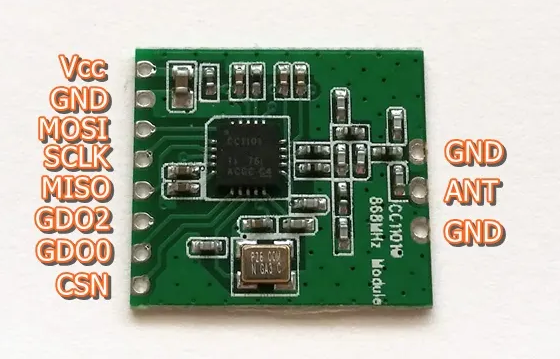
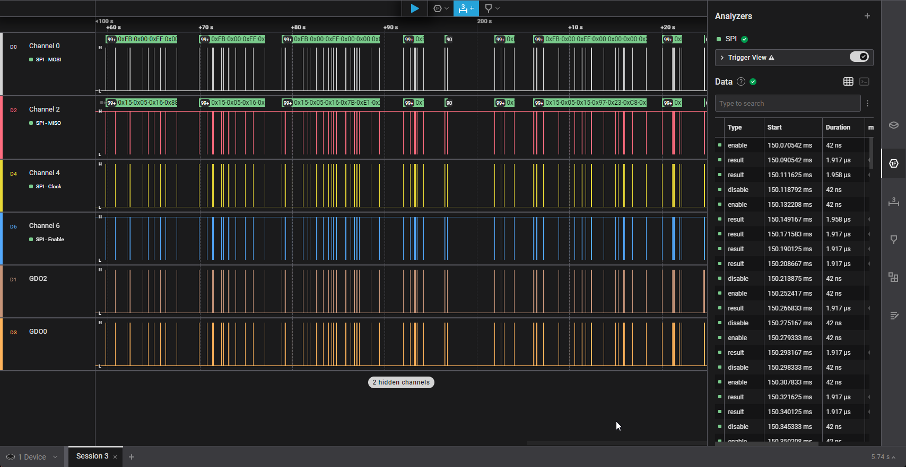
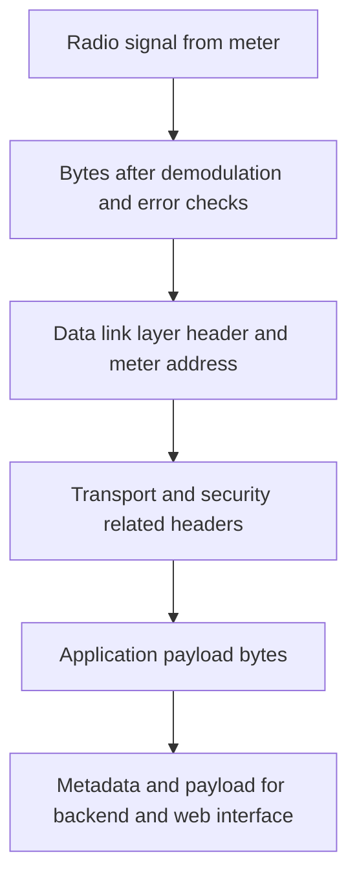
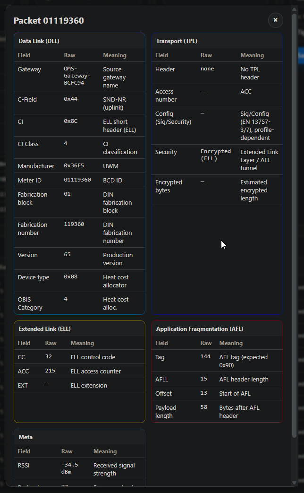

# OMS Gateway – Project Status and Key Concepts

> [!NOTE]
> This document summarizes the current state of the OMS Wireless M‑Bus Gateway
> and the main architectural ideas, from the meter in the field up to the
> dashboard.

---

## 1. Goal and Scope

The OMS Wireless M‑Bus Gateway has four main goals:

* Receive **OMS Wireless Meter‑Bus frames** in the 868 / 886 MHz band with a
  **Texas Instruments CC1101 sub‑GHz transceiver (CC1101)**.
* Use an **Espressif ESP32‑C3 microcontroller (ESP32‑C3)** with Wi‑Fi as the
  central platform.
* Forward frames, metadata and encrypted payload to a **backend and database**.
* Provide a **web interface (Web UI)** for configuration and live monitoring.

Decryption and interpretation of meter readings are **not** performed on the
radio side. They are part of the **data processing pipeline** in the backend
and belong to the next development step together with the **Application Layer
(APL)** parsing.

---

## 2. End‑to‑End System Picture

### 2.1 Big Picture

* The **OMS meter device** sends encrypted Wireless M‑Bus frames over the air.
* The **OMS gateway** receives the radio signal, decodes the protocol layers
  and forwards encrypted payload plus metadata.
* The **time series database** stores the data for long‑term analysis.
* The **visualization dashboard** shows trends, alarms and reports.

### 2.2 OMS Protocol Layers

An overview of the protocol layers used in the project:

The implementation focuses on:

* **Physical Layer (PHY)**
* **Data Link Layer (DLL)**
* **Transport Layer (TPL)** and **Extended Link Layer (ELL)**
* **Application Frame Layer (AFL)** and **Application Layer (APL)**

The gateway extracts the structure and metadata of these layers so that the
backend can apply decryption and application‑specific parsing.

---

## 3. Hardware Status

### 3.1 Main Components

* **Espressif ESP32‑C3 microcontroller (ESP32‑C3)**
  Provides Wi‑Fi connectivity, USB‑C power and enough resources for radio
  control, web server and configuration logic.

* **Texas Instruments CC1101 sub‑GHz transceiver (CC1101)**
  Receives OMS Wireless Meter‑Bus frames in the 868 / 886 MHz band.

| ESP32‑C3 and CC1101                            | Description                                                              |
| ---------------------------------------------- | ------------------------------------------------------------------------ |
|  | First working prototype of the OMS gateway based on ESP32‑C3 and CC1101. |

> [!WARNING]
> Pinouts of low‑cost CC1101 breakout boards are inconsistent. The design uses
> the original Texas Instruments documentation as the primary reference for
> wiring and register configuration.

### 3.2 Wiring and Pinout

| ESP32‑C3 SuperMini pinout                                       | CC1101 module pinout                                                |
| --------------------------------------------------------------- | ------------------------------------------------------------------- |
|  |  |

Relevant connections:

* **Serial Peripheral Interface (SPI)** bus: MOSI, MISO, SCLK, CSN
* **General Digital Output (GDO)** pins: GDO0 and GDO2 for interrupts and
  status signals
* **Power supply:** VCC and GND

During bring‑up a conflict with an on‑board **Light Emitting Diode (LED)** pin
was identified. That pin was initially used for the CC1101 and caused unstable
SPI behaviour. After rewiring, the SPI link is stable and the CC1101 responds
reliably.

---

## 4. Bring‑Up and Debugging

### 4.1 Arduino‑Based Sanity Check

To reduce risk, the radio path was validated with simple **Arduino‑style test
firmware**:

* [x] Initialize the Serial Peripheral Interface (SPI) and the CC1101.
* [x] Read CC1101 identification registers `PARTNUM` and `VERSION`.
* [x] Switch the CC1101 into receive mode.
* [x] Use open‑source libraries (`mfurga/cc1101` and
  `alex-icesoft/esp32_cc1101_wmbus`) for quick tests.
* [x] Observe that Wireless Meter‑Bus frames are received on air.

This confirms that wiring, basic configuration and timing are correct.

### 4.2 Logic Analyzer Investigation

A **logic analyzer** was used on SCLK, CSN, MOSI, MISO, GDO0 and GDO2 to
clarify communication problems.

| Logic analyzer on the setup                                  | Logic analyzer signals                   |
| ------------------------------------------------------------ | ---------------------------------------- |
|  |  |

Checklist:

* [x] Chip Select (CSN) toggles cleanly around each SPI transfer.
* [x] Serial Clock (SCLK) is active only while Chip Select (CSN) is low.
* [x] MOSI and MISO show plausible data patterns.
* [x] General Digital Output (GDO) pins toggle when packets are received.

This created a **stable baseline** for further protocol work.

---

## 5. Radio Environment and Receiver Tuning

### 5.1 Operating Environment

The prototype is tested in a dense city environment with many other systems in
the 868 MHz band:

* Multiple OMS Wireless Meter‑Bus meters.
* Various Internet of Things (IoT) devices.
* Alarm systems and other proprietary radios.

As a result, the gateway sees many frames and background activity. Selecting
robust receiver parameters is essential.

### 5.2 CC1101 Receiver Parameters

Three parameters of the Texas Instruments CC1101 transceiver are now used for
practical tuning:

| Setting                                  | Options                    | Current choice | Effect                                                                                                              |
| ---------------------------------------- | -------------------------- | -------------- | ------------------------------------------------------------------------------------------------------------------- |
| Automatic Gain Control (AGC) sensitivity | low or high                | high           | High sensitivity increases range but also increases noise; low sensitivity reduces false packets but reduces range. |
| Carrier Sense (CS) threshold             | LOW, DEFAULT, MEDIUM, HIGH | DEFAULT        | Defines when the channel is considered busy. LOW is very sensitive, HIGH ignores weaker signals.                    |
| Sync Word correlation mode               | DEFAULT, TIGHT, STRICT     | TIGHT          | A more strict correlation mode reduces false detections at the cost of dropping weak frames.                        |

Current configuration (TIGHT Sync Word mode and DEFAULT Carrier Sense level)
provides a good balance between robustness and false positives in this
environment.

---

## 6. Mechanical Prototype

A simple **three‑dimensional (3D) printed enclosure** was designed to combine
the ESP32‑C3 board and the CC1101 module into a single unit.

| Enclosure open                                      | Enclosure with lid                            |
| --------------------------------------------------- | --------------------------------------------- |
|  |  |

Characteristics:

* Provides safe mechanical mounting and a reproducible lab setup.
* Offers easy USB‑C access for power and flashing.
* Is sufficient for tests but not yet optimised for radio frequency behaviour
  because some cables cross the ESP32‑C3 Wi‑Fi antenna area.

A later revision is planned with a dedicated Printed Circuit Board (PCB) and a
radio‑frequency clean layout.

---

## 7. Firmware and Protocol Handling

### 7.1 General Processing Chain

The firmware follows a **layered decoding approach** for OMS Wireless
Meter‑Bus frames. The idea is to move step by step from the radio signal to a
structured description that can be stored or further processed.

Short description of each step:

1. **Physical Layer (PHY)**
   The radio front end demodulates the signal and performs basic checks such as
   error detection. The result is a clean byte buffer.

2. **Data Link Layer (DLL)**
   The firmware reads the Data Link Layer header, including length, control
   field, Communication Identification (CI) field, manufacturer, meter
   identification, version and device type.

3. **Transport Layer (TPL) and Extended Link Layer (ELL)**
   Depending on the Communication Identification field, the firmware identifies
   whether a Transport Layer header or an Extended Link Layer header is
   present. These layers contain access numbers, status information and
   security related configuration bits.

4. **Application Frame Layer (AFL)**
   When an Application Frame Layer is present, the firmware locates the
   encrypted part of the frame and records its position and length.

5. **Application Layer (APL)**
   The Application Layer payload is kept as a sequence of bytes. No
   device‑specific field parsing is done on the gateway.

6. **Output to backend and Web UI**
   The gateway forwards the raw bytes, the encrypted payload, and all metadata
   (such as meter address and signal quality) to the backend and exposes them
   in the Web UI.

### 7.2 Role of Encryption

Encryption is treated as part of the **data processing pipeline**:

* The gateway does **not** store symmetric keys and does **not** perform
  decryption of meter readings.
* The gateway identifies where the encrypted payload is located in the frame
  using the Transport Layer, Extended Link Layer and Application Frame Layer.
* The backend receives the encrypted payload plus the necessary metadata to
  perform decryption and Application Layer parsing.

The next development step is to connect the identified security configuration
fields to a concrete decryption implementation in the backend and to implement
correct Application Layer parsing.

---

## 8. Web Interface

The ESP32‑C3 microcontroller hosts a **single‑page Web UI** that allows
configuration and monitoring in a standard web browser.

### 8.1 Status Overview

The top bar shows:

* Network status (Access Point mode or Station mode, Received Signal Strength
  Indicator (RSSI), Internet Protocol (IP) address).
* Backend connectivity (reachable or not reachable).
* Whitelist summary.
* Number of recently received frames.

### 8.2 Configuration Sections

* **Network configuration**
  Configure Wi‑Fi client and Access Point settings, hostname and IP details.

* **Backend configuration**
  Configure the backend Uniform Resource Locator (URL) or Message Queuing
  Telemetry Transport (MQTT) endpoint and test connectivity.

* **Whitelist management**
  Allow or block meters based on manufacturer code and meter identification.

* **Radio configuration**
  Adjust Carrier Sense threshold and Sync Word correlation mode of the
  CC1101 transceiver.

### 8.3 Packet Monitor and Details

The Packet Monitor shows for each received frame:

* Control field, Communication Identification field, manufacturer code, meter
  identification, version and device type.
* Radio meta data such as Received Signal Strength Indicator and frame length.
* A hint whether the payload is encrypted and whether the frame matches the
  whitelist.

A details dialog displays one card per layer (Data Link Layer, Transport
Layer, Extended Link Layer, Application Frame Layer and general metadata). Only
layers that exist in the concrete frame are shown.

The Web UI does **not** display decrypted measurement values. It focuses on
structure, addresses and radio quality.

---

## 9. Progress Checklist

### 9.1 Implemented

* [x] Hardware bring‑up of ESP32‑C3 microcontroller and CC1101 transceiver.
* [x] Stable Serial Peripheral Interface communication validated with logic
  analyzer.
* [x] Reception of Wireless Meter‑Bus frames in a real 868 MHz city
  environment.
* [x] Layered decoding concept for Physical Layer, Data Link Layer, Transport
  Layer, Extended Link Layer, Application Frame Layer and Application
  Layer.
* [x] Web interface for status, configuration and packet monitoring.

### 9.2 Next Steps

* [ ] Interpret security configuration bits of the Transport Layer and
  Extended Link Layer in the backend.
* [ ] Implement decryption of encrypted payloads in the backend.
* [ ] Implement Application Layer parsing for relevant meter profiles.
* [ ] Improve radio‑frequency layout with a dedicated Printed Circuit Board.
* [ ] Extend automated tests and documentation for additional developers.

---

## 10. References

* Texas Instruments CC1101 datasheet.
* Texas Instruments application note SWRA234 with example code for CC1101.
* Open‑source CC1101 and Wireless Meter‑Bus libraries used for initial
  validation (`mfurga/cc1101` and `esp32_cc1101_wmbus`).
