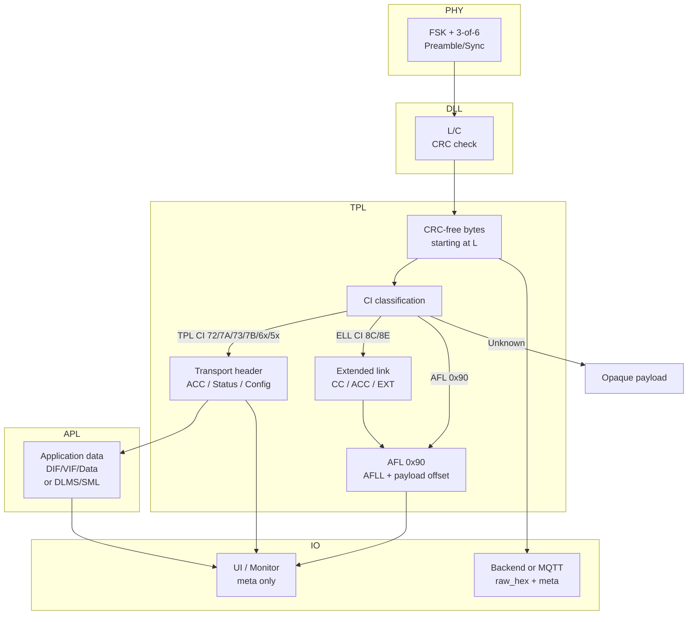

## OMS Gateway – Development Notes

### Context & Goal
- OMS gateway built on ESP32-C3 + CC1101 for 868/886 MHz.
- Wi-Fi support for convenient configuration and a future web UI.

### Hardware Selection
- ESP32-C3: compact, sufficient performance, integrated Wi-Fi.
- CC1101: low-RF transceiver listening on 868/886 MHz for OMS/W-MBus.

*ESP32-C3 and CC1101 as the gateway foundation*

| ESP32-C3 SuperMini pinout | CC1101 module pinout |
| --- | --- |
|  |  |

### First Wiring & Arduino Tests
- Modules soldered/wired; Arduino libraries + example sketch to validate SPI/interrupts and receive first packets.
- Pinouts online were inconsistent → initial miswiring.

*Initial wiring and test bench*

### Debugging with Logic Analyzer
- Logic analyzer used to verify SCLK/CS/MOSI/MISO plus GDO0/GDO2.
- Conflict with onboard LED identified → rewired pins → stable SPI comms, first (partly noisy) packets.

| Logic analyzer on the setup | Logic analyzer signals |
| --- | --- |
|  |  |

### Protocol Research & References
- CC1101 datasheet: [CC1101 DATASHEET](https://www.ti.com/de/lit/gpn/cc1101).
- TI application note with example code: [Application note AN067](https://www.ti.com/de/lit/pdf/swra234), [CODE](http://www.ti.com/lit/zip/SWRA234).
- Arduino libraries used for initial tests: [CC1101 by mfurga](https://github.com/mfurga/cc1101), [esp32_cc1101_wmbus by alex-icesoft](https://github.com/alex-icesoft/esp32_cc1101_wmbus).

### Challenges
- High RF noise in city center → many apparent packets; hard to verify without SDR.
- SPI channel now stable, RX side working; three key receiver settings (AGC profile, carrier-sense threshold, sync-word correlation) identified for tuning.

### Receiver Settings
| Setting | Options | Default | Notes |
| --- | --- | --- | --- |
| AGC sensitivity profile | `low_sensitivity` true/false | false (high sensitivity) | High sensitivity maximizes range but is noisier; low sensitivity reduces false wakes in dirty RF but shortens range. |
| Carrier-sense threshold | `CC1101_CS_LEVEL_{LOW,DEFAULT,MEDIUM,HIGH}` | DEFAULT | Tunes CCA “channel busy”: LOW is most sensitive (can appear always busy), HIGH ignores weak interferers (risk of hidden node). |
| Sync-word correlation | `CC1101_SYNC_MODE_{DEFAULT,TIGHT,STRICT}` | TIGHT | 15/16+CS (DEFAULT), 16/16+CS (TIGHT), or 30/32+CS (STRICT); stricter modes cut false syncs but may drop marginal frames. |

### Mechanics
- Simple enclosure modeled in a CAD tool; two quick iterations to align the USB-C port flush with the housing.
- Pure prototype (not product design): minimal volume to hold both boards. Wiring encroaches on the ESP32-C3 WLAN antenna area—suboptimal for RF, but sufficient for testing.

| Enclosure open | Enclosure with lid |
| --- | --- |
|  |  |

### OMS Frame Handling (Layered)

- Byte pipeline: PHY/3-of-6 decode → CRC removal → DLL+TPL header parse (`WmbusFrameInfo`).
- Layer mapping: DLL = L/C; TPL = M/ID/Version/DeviceType/CI + ACC/Status/Config; APL = DIF/VIF/data. ELL/AFL are treated as security tunnels.
- CI classes: TPL (0x72/7A/73/7B/6B/6A/69/5A/5B), ELL (0x8C/8E), AFL/security tunnel (0x90). Unknown CI leaves payload opaque.
- Parsing helpers (`app/wmbus/frame_parse.*`):
  - TPL header: short/long ACC/Status/Config only when CI defines a length.
  - ELL header: CC/ACC and optional 8-byte EXT (0x8E).
  - Security heuristic: ELL present → treat as encrypted tunnel; TPL Config/Signature ≠ 0 → likely encrypted; otherwise unencrypted/unknown.
- Data model scaffold (`app/wmbus/parsed_frame.h`): raw logical bytes + TPL/ELL/security meta; APL parsing and decryption hook can be added later.
- UI/monitor: shows CI class (SHORT/LONG/ELL/NONE), encryption status, and ELL/TPL meta in the detail modal; table stays lean.

### Current Status & Next Steps (checklist)
- [x] Receive path operational; basic configuration possible.
- [x] Helper layer: services + runtime; NVS-backed helpers for Wi-Fi creds/hostname, backend URL, whitelist, radio CS/sync.
- [ ] Web UI: AP onboarding → STA Wi-Fi config; styled interface with live W-MBus monitor (packet list with ID, CRC status, metadata).
- [ ] Packet table actions: add sender address to whitelist via button when packet is valid.
- [ ] Whitelist logic: only whitelisted packets get forwarded.
- [ ] Backend config via UI: domain/IP/port; reachability test.
- [ ] Whitelist view: list entries, remove entry via button.
- [ ] Expose receiver settings (AGC, CS level, sync mode) via UI.
- [ ] Backend (Python + FastAPI): accept frames + metadata, manage/store AES-128 keys securely via minimal web UI.
- [ ] Backend processing: decrypt payload, publish via MQTT, persist to InfluxDB, enable Grafana dashboards on stored data.
