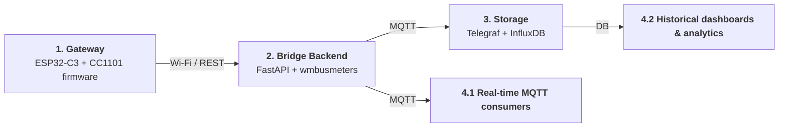

# OMS Gateway – Project Status and Key Concepts

> [!NOTE]
> This document summarizes the current state of the OMS Wireless M‑Bus Gateway
> and the main architectural ideas, from the meter in the field up to the
> dashboard.

> [!IMPORTANT]
> Repository structure update: this repo now focuses solely on the ESP-IDF
> firmware. The FastAPI backend lives in a dedicated repository
> ([oms-bridge](https://gitBridge.com/quietmetrics/oms-bridge)), ensuring both codebases can evolve
> independently while keeping their documentation close to the relevant code.

> [!TIP]
> Need a layer-by-layer breakdown of the OMS stack? See `doc/OMS_PROTOCOL_STACK.md`
> for a companion guide that mirrors OMS Volume 2 and references the codebase.

---

## 1. Goal and Scope

The OMS Wireless M‑Bus Gateway has four main goals:

* Receive **OMS Wireless Meter‑Bus frames** in the 868 / 886 MHz band with a
  **Texas Instruments CC1101 sub‑GHz transceiver (CC1101)**.
* Use an **Espressif ESP32‑C3 microcontroller (ESP32‑C3)** with Wi‑Fi as the
  central platform.
* Forward frames, metadata and encrypted payload to a **backend and database**.
* Provide a **web interface (Web UI)** for configuration and live monitoring.

Decryption and interpretation of meter readings are **not** performed on the
radio side. They are part of the **data processing pipeline** in the backend
and belong to the next development step together with the **Application Layer
(APL)** parsing.

---

## 2. End‑to‑End System Picture

### 2.1 Big Picture

* The **OMS meter device** sends encrypted Wireless M‑Bus frames over the air.
* The **OMS gateway** receives the radio signal, decodes the protocol layers
  and forwards encrypted payload plus metadata.
* The **time series database** stores the data for long‑term analysis.
* The **visualization dashboard** shows trends, alarms and reports.

> [!NOTE] Current Build Status  
> - [x] Stable RF receive path (CC1101 HAL, Mode C timing, RSSI/LQI logging)  
> - [x] Layered parser (DLL → ELL → AFL → TPL) filling `wmbus_parsed_frame_t` for UI/backend  
> - [x] Web UI for Wi-Fi onboarding, radio presets, backend probe, live monitor  
> - [x] FastAPI backend stub ready for MQTT/InfluxDB forwarding  
> - [x] Active-low LED HAL for Wi-Fi/payload feedback on GPIO8  
> - [ ] Backend decryption + Application Layer parsing  
> - [ ] Finalize MQTT/InfluxDB bridge and RF-optimized hardware rev

### 2.2 OMS Protocol Layers

An overview of the protocol layers used in the project:

The implementation focuses on:

* **Physical Layer (PHY)**
* **Data Link Layer (DLL)**
* **Transport Layer (TPL)** and **Extended Link Layer (ELL)**
* **Application Frame Layer (AFL)** and **Application Layer (APL)**

The gateway extracts the structure and metadata of these layers so that the
backend can apply decryption and application‑specific parsing.

### 2.3 Application Payload Strategy

OMS meters embed their readings in CI-dependent payloads (M‑Bus DIF/VIF trains,
DLMS/COSEM APDUs, SML frames, service protocols, etc.). Parsing those streams
requires a large, meter-specific knowledge base (storage slots, quantities,
descriptors). Instead of duplicating projects such as
[`wmbusmeters`](../EXAMPLE_WMBUSMASTER/wmbusmeters) on the ESP32 (which would
exceed the available flash/RAM and be hard to keep up to date), the firmware
currently forwards the entire logical frame to the backend/Web UI. The monitor
UI now exposes a raw-hex copy button so external tools can ingest exactly what
the gateway received. Full decoding is therefore expected to happen off-device
where mature, easily updateable drivers already exist.

---

## 3. Hardware Status

### 3.1 Main Components

| Component | Role in the gateway |
| --------- | ------------------- |
| **Espressif ESP32‑C3** | MCU platform with Wi‑Fi, USB‑C power, FreeRTOS runtime for radio control + Web UI. |
| **TI CC1101 (sub‑GHz)** | Frontend for OMS Mode C reception, SPI-connected with dedicated GPIO interrupts. |
| **Enclosure / CAD** | 3D-printed shell combining ESP32‑C3 + CC1101 for a repeatable lab setup. |

| ESP32‑C3 and CC1101                            | Description                                                              |
| ---------------------------------------------- | ------------------------------------------------------------------------ |
|  | First working prototype of the OMS gateway based on ESP32‑C3 and CC1101. |

> [!WARNING]
> Pinouts of low‑cost CC1101 breakout boards are inconsistent. The design uses
> the original Texas Instruments documentation as the primary reference for
> wiring and register configuration.

### 3.2 Wiring and Pinout

| ESP32‑C3 SuperMini pinout                                       | CC1101 module pinout                                                |
| --------------------------------------------------------------- | ------------------------------------------------------------------- |
|  |  |

Relevant connections:

* **Serial Peripheral Interface (SPI)** bus: MOSI, MISO, SCLK, CSN
* **General Digital Output (GDO)** pins: GDO0 and GDO2 for interrupts and
  status signals
* **Power supply:** VCC and GND

During bring‑up a conflict with an on‑board **Light Emitting Diode (LED)** pin
was identified. That pin was initially used for the CC1101 and caused unstable
SPI behaviour. After rewiring, the SPI link is stable and the CC1101 responds
reliably.

---

## 4. Bring‑Up and Debugging

### 4.1 Arduino‑Based Sanity Check

To reduce risk, the radio path was validated with simple **Arduino‑style test
firmware**:

* [x] Initialize the Serial Peripheral Interface (SPI) and the CC1101.
* [x] Read CC1101 identification registers `PARTNUM` and `VERSION`.
* [x] Switch the CC1101 into receive mode.
* [x] Use open‑source libraries (`mfurga/cc1101` and
  `alex-icesoft/esp32_cc1101_wmbus`) for quick tests.
* [x] Observe that Wireless Meter‑Bus frames are received on air.

This confirms that wiring, basic configuration and timing are correct.

### 4.2 Logic Analyzer Investigation

A **logic analyzer** was used on SCLK, CSN, MOSI, MISO, GDO0 and GDO2 to
clarify communication problems.

| Logic analyzer on the setup                                  | Logic analyzer signals                   |
| ------------------------------------------------------------ | ---------------------------------------- |
|  |  |

Checklist:

* [x] Chip Select (CSN) toggles cleanly around each SPI transfer.
* [x] Serial Clock (SCLK) is active only while Chip Select (CSN) is low.
* [x] MOSI and MISO show plausible data patterns.
* [x] General Digital Output (GDO) pins toggle when packets are received.

This created a **stable baseline** for further protocol work.

---

## 5. Radio Environment and Receiver Tuning

### 5.1 Operating Environment

> [!IMPORTANT]
> Dense urban RF environment (multiple OMS meters, IoT nodes, alarm radios)
> demands tight sync detection and conservative duty-cycle management to avoid
> false positives and collisions.

### 5.2 CC1101 Receiver Parameters

Three parameters of the Texas Instruments CC1101 transceiver are now used for
practical tuning:

| Setting                                  | Options                    | Current choice | Effect                                                                                                              |
| ---------------------------------------- | -------------------------- | -------------- | ------------------------------------------------------------------------------------------------------------------- |
| Automatic Gain Control (AGC) sensitivity | low or high                | high           | High sensitivity increases range but also increases noise; low sensitivity reduces false packets but reduces range. |
| Carrier Sense (CS) threshold             | LOW, DEFAULT, MEDIUM, HIGH | DEFAULT        | Defines when the channel is considered busy. LOW is very sensitive, HIGH ignores weaker signals.                    |
| Sync Word correlation mode               | DEFAULT, TIGHT, STRICT     | TIGHT          | A more strict correlation mode reduces false detections at the cost of dropping weak frames.                        |

Current configuration (TIGHT Sync Word mode and DEFAULT Carrier Sense level)
provides a good balance between robustness and false positives in this
environment.

---

## 6. Mechanical Prototype

A simple **three‑dimensional (3D) printed enclosure** was designed to combine
the ESP32‑C3 board and the CC1101 module into a single unit.

| Enclosure open                                      | Enclosure with lid                            |
| --------------------------------------------------- | --------------------------------------------- |
|  |  |

Characteristics:

* Provides safe mechanical mounting and a reproducible lab setup.
* Offers easy USB‑C access for power and flashing.
* Is sufficient for tests but not yet optimised for radio frequency behaviour
  because some cables cross the ESP32‑C3 Wi‑Fi antenna area.

A later revision is planned with a dedicated Printed Circuit Board (PCB) and a
radio‑frequency clean layout.

---

## 7. Gateway Firmware and Data Flow

### 7.1 End-to-End Data Flow

The former firmware-only decoding overview has been broadened into the complete
data journey: from RF capture on the gateway through backend processing to
storage and analytics. Each area owns a distinct responsibility so firmware,
backend, storage, and visualization can evolve independently while keeping the
hand-offs explicit.

1. **Gateway (Firmware)**
   * CC1101 + ESP32-C3 capture the RF signal (OMS Mode C), perform demodulation,
     whitening removal, 3-of-6 decoding, CRC verification, and frame boundary
     detection.
   * The firmware assembles a structured frame description: PHY stats (RSSI/LQI),
     DLL addresses, TPL/ELL security fields, AFL offsets, and the encrypted
     Application payload bytes. It does **not** decrypt or interpret the payload.
   * Frames and metadata are exposed to the Web UI for live monitoring and
     forwarded to the backend via Wi-Fi using the REST endpoint.

2. **Bridge (Backend)**
   * A dedicated FastAPI service (leveraging `wmbusmeters` tooling) receives frames
     from the gateway, runs security profile checks, performs AES decryption,
     validates MICs, and decodes the Application payload into typed fields
     (e.g., DIF/VIF values).
   * Parsed readings, diagnostic data, and events are published on MQTT topics so
     downstream services can subscribe without tight coupling to the API; this
     MQTT output is what feeds the storage layer.

3. **Storage**
   * Telegraf subscribes to the backend MQTT topics, normalizes the decoded data, and
     writes time-series metrics plus tags (meter ID, location, type) into
     InfluxDB.
   * Retention policies keep historical data accessible for trend analysis while
     bounding storage usage.

4. **Processing & Visualization**
   * This stage splits into fast reactions on MQTT events and deep dives on the
     stored history so operational alerts and long-term analytics stay decoupled.
   1. **4.1 Real-Time MQTT Consumers** – Automation services or lightweight workers
      subscribe directly to the Bridge’s MQTT topics for immediate actions (alerts,
      actuator commands, anomaly triggers) without waiting for storage.
   2. **4.2 Historical Dashboards & Analytics** – Grafana, notebooks, or
      data-science jobs query InfluxDB (optionally blending cached MQTT snapshots)
      to build dashboards, reports, batch analytics, or export data to billing/ERP
      systems without touching the gateway firmware.

### 7.2 Role of Encryption

Encryption is treated as part of the **data processing pipeline**:

* The gateway does **not** store symmetric keys and does **not** perform
  decryption of meter readings.
* The gateway identifies where the encrypted payload is located in the frame
  using the Transport Layer, Extended Link Layer and Application Frame Layer.
* The backend receives the encrypted payload plus the necessary metadata to
  perform decryption and Application Layer parsing.

The next development step is to connect the identified security configuration
fields to a concrete decryption implementation in the backend and to implement
correct Application Layer parsing.

### 7.3 OMS Protocol Stack in This Project

The OMS / Wireless M‑Bus stack inside this repository closely mirrors Volume 2 of the OMS specification:

1. ⚙️ **Physical Layer** – CC1101 runs Mode C timings (preamble, 3-of-6 coding) and enforces duty-cycle limits per meter type. LPWAN annex parameters are tracked for future range experiments.
2. 📶 **Link / Extended Link Layer** – `main/wmbus/pipeline.c` verifies C/L-fields, addresses (LLA + ELLA), hop bits and synchronous timing, handing off clean payloads plus RSSI/LQI.
3. 🧷 **Authentication & Fragmentation Layer (AFL)** – Fragment headers, MACs and Ki-flags are parsed so Security Profiles B–D can be validated even if payload stays encrypted.
4. 📬 **Transport Layer (TPL)** – CI-field, Access Number, Status bits and Configuration Field are decoded and surfaced to the UI/backend, enabling command workflows and Application Error reporting.
5. 📦 **Application Protocols (backend)** – The firmware forwards logical frames verbatim; decoding DIF/VIF trains, DLMS, or SML payloads now happens in the FastAPI/wmbusmeters backend using [wmbusmeters](https://gitBridge.com/wmbusmeters/wmbusmeters).

For a detailed walkthrough of each layer, message type, and how the code maps to OMS Volume 2 see **`doc/OMS_PROTOCOL_STACK.md`**.

---

## 8. Web Interface

The ESP32‑C3 microcontroller hosts a **single‑page Web UI** that allows
configuration and monitoring in a standard web browser.

### 8.1 Status Overview

The top bar shows:

* Network status (Access Point mode or Station mode, Received Signal Strength
  Indicator (RSSI), Internet Protocol (IP) address).
* Backend connectivity (reachable or not reachable).
* Number of recently received frames.

### 8.2 Configuration Sections

| Section | Purpose |
| ------- | ------- |
| **Network** | Configure Wi‑Fi STA/AP credentials, hostname, and IP variables. |
| **Backend** | Set HTTP/MQTT endpoints, run reachability probe, and view status. |
| **Radio** | Adjust CC1101 CS thresholds, sync correlation, and monitor live stats. |

### 8.3 Packet Monitor and Details

The Packet Monitor shows for each received frame:

* Control field, Communication Identification field, manufacturer code, meter
  identification, version and device type.
* Radio meta data such as Received Signal Strength Indicator and frame length.
* A hint whether the payload is encrypted.

A details dialog displays one card per layer (Data Link Layer, Transport
Layer, Extended Link Layer, Application Frame Layer and general metadata). Only
layers that exist in the concrete frame are shown.

The Web UI does **not** display decrypted measurement values. It focuses on
structure, addresses and radio quality.

---

## 9. Progress Checklist ✅

### 9.1 Implemented

| ✅ Delivered | Notes |
| ------------ | ----- |
| Hardware bring‑up (ESP32‑C3 + CC1101) | SPI + GPIO paths validated, enclosure available. |
| Stable SPI comms | Logic analyzer traces confirm reliable transfers/interrupts. |
| Live RF reception | Real OMS traffic decoded in-city with RSSI/LQI logged. |
| Layered decoding | PHY → DLL/ELL → AFL/TPL → metadata pipeline implemented. |
| Web interface | Handles Wi‑Fi/backend/radio configuration + monitor. |

### 9.2 Next Steps

| 🧭 Focus | Description |
| -------- | ----------- |
| Backend security parsing | Interpret CF/AFL security bits in FastAPI service. |
| Payload decryption | Implement AES/TLS handling + key management on backend. |
| Application parsing | Decode mandatory OMS data points (Annex B) downstream. |
| Hardware rev | Improve RF layout with dedicated PCB and clean antenna path. |
| QA & docs | Expand automated tests and contributor guidance. |

---

## 10. References

* Texas Instruments CC1101 datasheet.
* Texas Instruments application note SWRA234 with example code for CC1101.
* Open‑source CC1101 and Wireless Meter‑Bus libraries used for initial
  validation (`mfurga/cc1101` and `esp32_cc1101_wmbus`).
